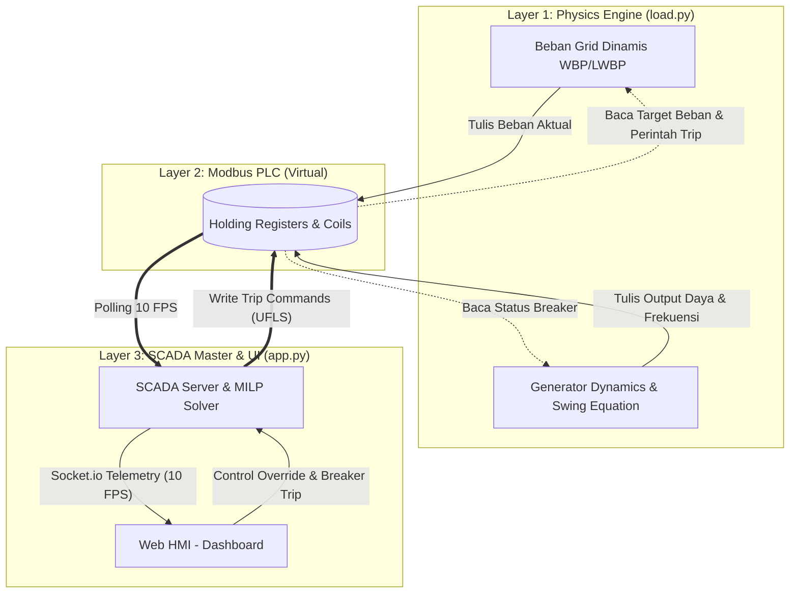

# SCADA-Based Optimal Load Shedding and Recovery 
## Using Mathematical Optimization Under Generation and Feeder Contingencies

## Abstrak
Proyek ini mengusung pengembangan *Real-Time Digital Twin* berskala industri untuk Sistem Tenaga Listrik. Sistem ini dirancang untuk mensimulasikan dinamika frekuensi transien, respons kontrol primer (*Governor Droop Control*), dan melakukan optimasi pelepasan beban (*Under-Frequency Load Shedding* / UFLS) berbasis algoritma optimasi *Mixed-Integer Linear Programming* (MILP). Dengan resolusi eksekusi sebesar 100 ms (10 FPS), simulasi ini memodelkan kinetika energi jaringan secara *real-time* dan interaktif.

---

## 1. Pendahuluan
Stabilitas frekuensi pada sistem tenaga listrik sangat bergantung pada keseimbangan antara pembangkitan daya aktif dan beban. Gangguan atau hilangnya unit pembangkit secara tiba-tiba dapat menyebabkan defisit daya yang memicu penurunan frekuensi sistem (*frequency drop*). Jika tidak diatasi dengan mekanisme pelepasan beban yang tepat dan proporsional, sistem akan mengalami *blackout* atau mati listrik total. Proyek ini mendemonstrasikan secara interaktif penyelesaian masalah tersebut melalui implementasi komputasi komprehensif mulai dari *physics engine* hingga algoritma cerdas berbasis optimasi matematis.

---

## 2. Arsitektur Komunikasi Sistem
Sistem ini menggunakan arsitektur terdistribusi yang dibagi ke dalam tiga lapisan (layer) yang berkomunikasi menggunakan protokol standar industri, yaitu **Modbus TCP/IP**.



### 2.1 Logika Kontrol PLC (EcoStruxure Machine Expert - Basic)
Proyek ini mengintegrasikan simulasi PLC menggunakan skema *Ladder Logic* (LD) standar industri. Berdasarkan pemetaan *Memory Word* (%MW), kontrol breaker beban dan generator menggunakan implementasi kontak fail-safe dan override:

*   **Logika Generator (Rung 0 - 3):**
    Di sisi PLC, generator direpresentasikan menggunakan kontak *Normally Open* (`| |`) untuk status sensor fisiknya (contoh: `%M10` untuk PLTA) yang diserikan dengan kontak *Normally Closed* (`| / |`) sebagai *override* kontrol dari SCADA (contoh: `%M50`). Jika SCADA memerintahkan *trip* (menulis nilai logika `1` ke `%M50`), aliran daya akan terputus dan mematikan *coil* output utama `%Q0.0`.
*   **Logika Pelepasan Beban / Load Shedding (Rung 4 - 15):**
    Beban di lapangan seperti `L101` hingga `L405` terhubung menggunakan satu instruksi utama *Normally Closed* (`| / |`) dari Holding Register (contoh: `%M21` untuk L101). Secara *default*, selama jaringan stabil (logika `0`), *coil* beban `%Q0.4` tetap menyala. Saat algoritma optimasi MILP mendeteksi UFLS, Python akan menembakkan logika `1` ke alamat tersebut, membuat kontak PLC terbuka (*open circuit*) secara instan dan mematikan suplai beban. Umpan balik status pemadaman ini langsung dibaca kembali oleh SCADA melalui memori `%M60`.

---

## 3. Pemodelan Matematis dan Fisika (*Physics Engine*)
Modul `load.py` bertindak sebagai mesin fisika diferensial yang merepresentasikan perilaku putaran rotor sinkron berdasarkan prinsip kekekalan energi kinetik turbin-generator.

### 3.1 Persamaan Ayunan (*The Swing Equation*) dan *Rate of Change of Frequency* (RoCoF)
Dinamika transien frekuensi dimodelkan menggunakan persamaan ayunan. Saat terjadi *Network Deficit* (Total Beban > Total Pembangkitan), energi kinetik yang tersimpan di dalam rotor akan terlepas untuk menutupi defisit, menyebabkan deselerasi rotasi (penurunan frekuensi). 

Laju perubahan frekuensi (RoCoF atau $df/dt$) dihitung dengan persamaan:

$$ \frac{df}{dt} = \frac{f_{nom}}{2 \cdot H_{eff}} \times (\Delta P_{pu} - P_{damping}) $$

**Dimana:**
*   **$f_{nom}$**: Frekuensi nominal operasional grid (50.0 Hz).
*   **$\Delta P_{pu}$**: *Network Deficit* dalam per unit (pu). Diformulasikan dari selisih $(P_{Gen} - P_{Load})$ dibagi dengan daya dasar sistem ($S_{Base}$). Nilai negatif mengindikasikan bahwa sistem kekurangan pasokan daya.
*   **$H_{eff}$**: Konstanta Inersia Efektif (*Effective Inertia*, dalam detik). Merepresentasikan total momentum inersia jaringan berputar, dihitung secara proporsional dari setiap generator yang *online* (misal: PLTA $H=5$, PLTGU $H=3$, PLTS/B $H=0.5$).
*   **$P_{damping}$**: *Load Damping Factor*. Merepresentasikan respons alamiah beban (seperti motor induksi) yang menurunkan konsumsi daya saat frekuensi turun. Didefinisikan sebagai $P_{damping} = D \times \frac{f - f_{nom}}{f_{nom}}$.

Nilai frekuensi pada langkah waktu (time-step) berikutnya dihitung secara numerik menggunakan metode integrasi Euler:

$$ f_{t+\Delta t} = f_t + \left( \frac{df}{dt} \times \Delta t \right) $$

### 3.2 Kontrol Primer: *Governor Droop Control*
Sebagai respons terhadap deviasi frekuensi, sistem kontrol *governor* akan otomatis membuka atau menutup katup mekanis untuk mengatur daya mekanik (*Mechanical Power*). Karakteristik *droop* dirumuskan sebagai:

$$ \Delta P_{target} = -\left( \frac{f - f_{nom}}{f_{nom}} \right) \times \frac{1}{R} \times P_{Rated} $$

**Dimana:**
*   $R$: *Droop setting* (biasanya dalam rentang 4-5%).
*   $P_{Rated}$: Kapasitas daya maksimum generator.

### 3.3 Kontrol Sekunder: *Automatic Generation Control* (AGC)
Meskipun kontrol primer menstabilkan penurunan, frekuensi akan menetap pada kondisi tunak (*steady-state error*) yang berbeda dari $f_{nom}$. AGC berfungsi untuk memberikan *setpoint* daya tambahan secara perlahan (memanfaatkan *Spinning Reserve*) agar frekuensi kembali ke batas eksak **50.0 Hz**.

---

## 4. Algoritma Optimasi Pelepasan Beban (UFLS) berbasis SCADA
Pada modul `app.py`, jika frekuensi jatuh menyentuh ambang batas kritis (misalnya $\le 49.50$ Hz), SCADA akan mengaktifkan *Under-Frequency Load Shedding* (UFLS).

### 4.1 Formulasi *Mixed-Integer Linear Programming* (MILP)
Berbeda dengan pelepasan beban konvensional yang sering bersifat buta atau heuristik statis, algoritma ini memanfaatkan MILP untuk mengambil keputusan pemutusan paling optimal berdasarkan kombinasi beban yang aktif, sehingga dampak pemadaman diminimalisir sembari menyelamatkan sistem.

**Variabel Keputusan (*Decision Variables*):**
Status operasional setiap beban ($i$) direpresentasikan dengan variabel biner:
$$ x_i \in \{0, 1\} \quad \text{untuk } i = 1, 2, \dots, N $$
*   $x_i = 1$: Beban $i$ tetap tersambung (*Connected*).
*   $x_i = 0$: Beban $i$ dipadamkan (*Shedded*).

**Fungsi Objektif (*Objective Function*):**
Tujuan utama adalah meminimalisir total "kerugian" pemadaman, yang ditimbang (diberi bobot) berdasarkan utilitas beban (contoh: Rumah Sakit memiliki penalti/prioritas pemadaman tinggi).
$$ \min \sum_{i=1}^{N} (1 - x_i) \cdot P_i \cdot W_i $$
*   $P_i$: Daya aktual konsumsi beban $i$.
*   $W_i$: Bobot prioritas fasilitas (*Priority Weight*).

**Kendala Sistem (*Constraints*):**
Total daya yang dipadamkan harus setidaknya sama atau lebih besar dari besaran defisit sistem daya agar frekuensi stabil kembali:
$$ \sum_{i=1}^{N} (1 - x_i) \cdot P_i \ge P_{Defisit} $$

Sistem melakukan komputasi MILP ini menggunakan pustaka resolusi matematis (`PuLP`) dalam orde milidetik, lalu memberikan sinyal eksekusi *trip relay* ke *holding register* Modbus seketika.

### 4.2 Pencegahan Osilasi (Anti-Oscillation) & Dynamic Priority Swapping
Ketika sistem berada dalam kondisi stabil namun masih mengalami defisit pasokan (sebagian beban dipadamkan), menjalankan algoritma secara berulang dapat menyebabkan **osilasi status breaker** (kondisi di mana dua beban dengan prioritas yang sama bergantian menyala-mati tiap detik). 

Untuk mengatasi hal ini, algoritma memberikan "**Diskon Penalti 10%**" ($W_i \times 0.90$) pada fungsi objektif khusus untuk beban yang **saat ini sedang padam**. Diskon matematis ini memastikan solver cenderung "mempertahankan" beban yang sudah padam daripada menukarnya dengan beban lain berprioritas sama, sehingga osilasi terhindari. Namun, karena diskon ini tidak melebihi selisih antar tingkat prioritas dasar, jika operator mengubah prioritas beban yang mati menjadi lebih tinggi (misalnya VIP), algoritma secara cerdas dan instan akan melakukan *Dynamic Priority Swapping*—menyalakan kembali VIP tersebut dan menumbalkan beban prioritas rendah lain sebagai gantinya.

### 4.3 Matriks Kontingensi N-1 Secara *Live*
Bahkan pada frekuensi stabil 50 Hz, MILP terus menghitung probabilitas terburuk (*predictive analysis*) pada skenario kegagalan tunggal (N-1). Jika generator terbesar terputus, matriks akan menampilkan *Feeder* prioritas rendah mana saja yang di-"*Preselection*" merah untuk siap dikorbankan.

---

## 5. Antarmuka HMI dan Telemetri Visual
Human Machine Interface (HMI) yang berada pada `main.js` & `index.html` berperan sebagai *Control Room* dinamis:
*   **Telemetri Kecepatan Tinggi (10 FPS):** Menembakkan paket event `grid_update` via **Socket.IO** secara kontinyu.
*   **Plot Transien (*Transient Plotting*):** *Buffer array circular* menampung dan menggambarkan pergerakan frekuensi presisi tinggi, memungkinkan pemantauan titik *Nadir* (titik terendah) saat interupsi pasokan daya terjadi.
*   **Manajemen Memori (*Anti-Latch*):** Sistem diatur untuk menghapus *latch* perintah trip dari kegagalan komputasi historis di awal, mencegah pemadaman abadi.

---

## 6. Panduan Implementasi dan Penggunaan

Sistem ini didesain sebagai arsitektur *multi-threaded* dan memerlukan beberapa tahapan instalasi/eksekusi lokal:

1. **Jalankan Aplikasi PLC Virtual:**
   Pastikan OpenModScan atau *Modbus PLC simulator* lainnya aktif pada TCP Port standar.
   
2. **Inisialisasi *Physics Engine*:**
   Buka Terminal 1 dan jalankan mesin dinamis kelistrikan.
   ```bash
   cd Beban_Grid
   python load.py
   ```
   *(Log *real-time* pergerakan RoCoF dan frekuensi akan tercetak)*

3. **Inisialisasi *SCADA Master*:**
   Buka Terminal 2 dan jalankan server berbasis web serta rutin MILP.
   ```bash
   cd Scada_22-5-26
   python app.py
   ```

4. **Monitoring *Control Room*:**
   Arahkan *web browser* Anda ke tautan:
   `http://127.0.0.1:5000/?role=admin`
   
   > **Catatan Pengujian:** Tekan tuas **"TRIP"** pada salah satu unit generator besar (seperti PLTGU) untuk mensimulasikan *contingency event*, lalu saksikan bagaimana *governor* primer merespons jatuhnya frekuensi dan algoritma MILP menyeimbangkan grid seketika melalui kurva grafik *real-time*.

---

## 7. Referensi Teknis Lanjutan (*Deep Dive Documentation*)

Proyek ini terstruktur ke dalam 3 modul pilar utama. Untuk mendalami perhitungan matematis, arsitektur kode, hingga pengalamatan I/O, silakan meninjau berkas dokumentasi spesifik pada setiap folder:

1. ⚙️ **[Physics Engine & Dinamika Kelistrikan (Beban_Grid/README.md)](Beban_Grid/README.md)**
   Penjelasan detail mengenai *Swing Equation*, Integrasi Euler, dan algoritma *Governor Droop / AGC* untuk simulasi inersia.
2. 🧠 **[SCADA Master & HMI Web (Scada_22-5-26/README.md)](Scada_22-5-26/README.md)**
   Penjelasan komprehensif formulasi matematika *Mixed-Integer Linear Programming* (MILP), Anti-Osilasi, arsitektur *backend* Flask/Socket.IO, dan algoritma grafis UI.
3. 🏭 **[Virtual PLC & Skema Industri (VirtualPLC/README.md)](VirtualPLC/README.md)**
   Spesifikasi perangkat keras EcoStruxure Machine Expert - Basic, peta alamat memori (*Memory Word Mapping*), dan kupas tuntas implementasi *fail-safe Ladder Logic*.
