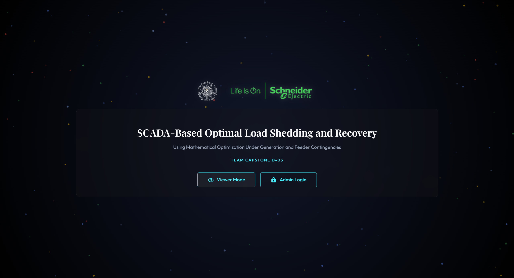
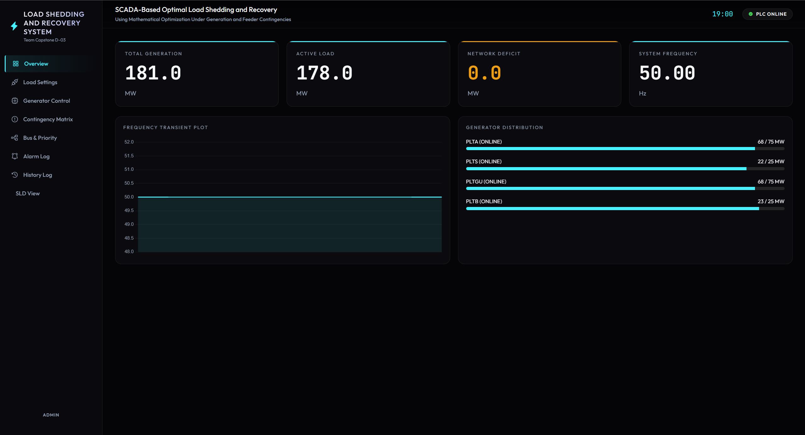
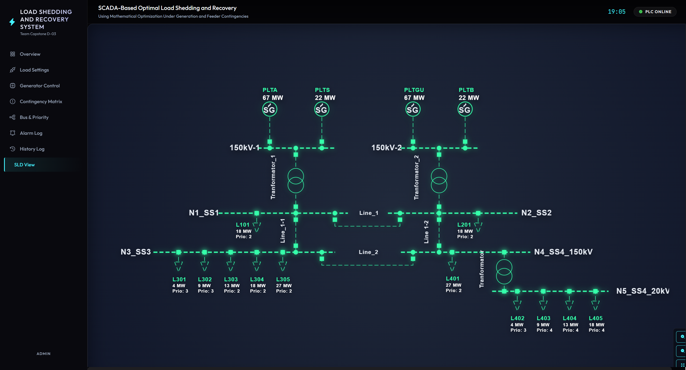
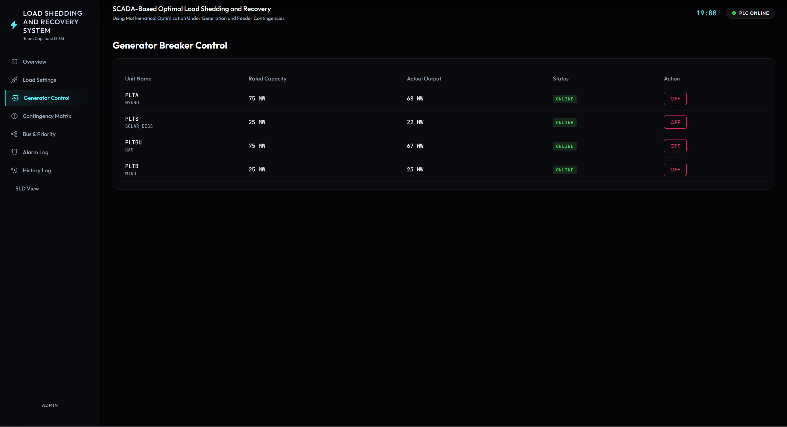
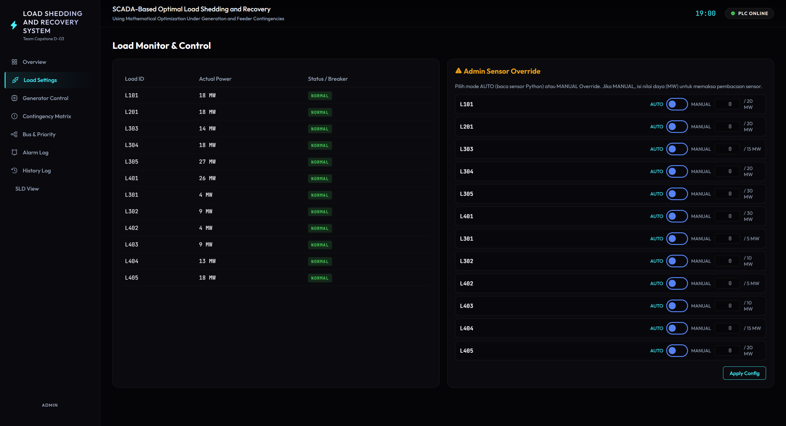
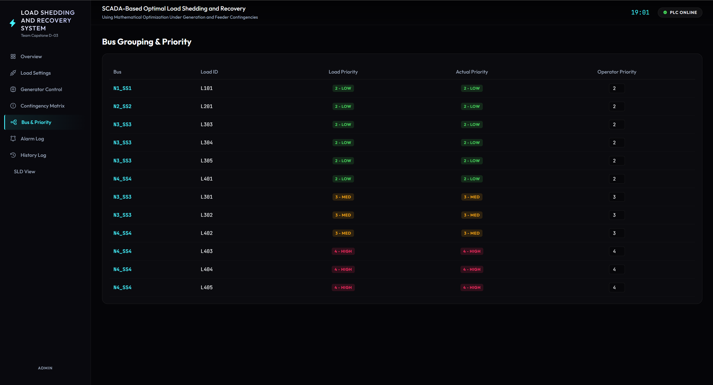
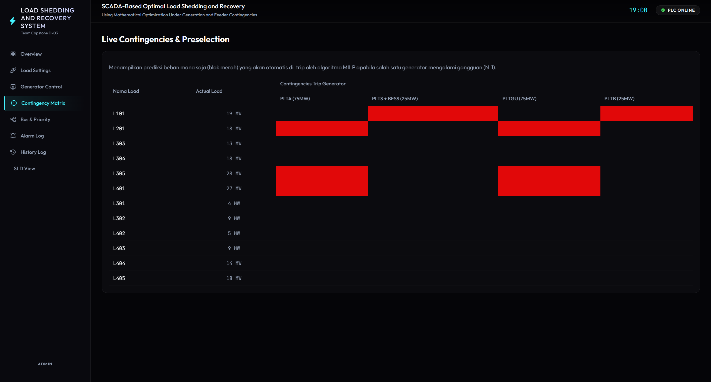
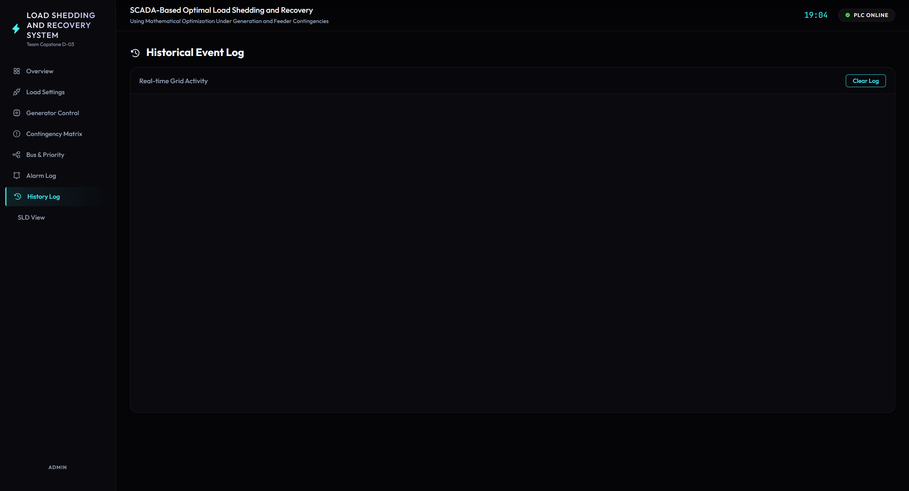
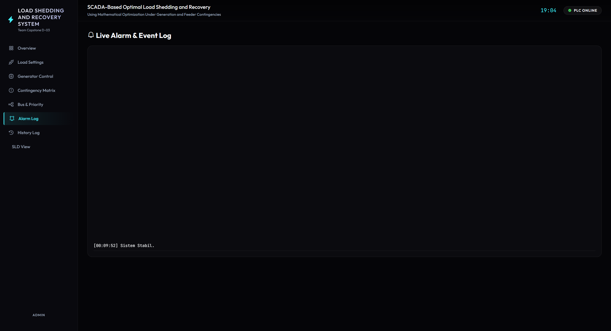

# Dokumentasi SCADA Master & Web HMI

Folder ini menaungi sistem saraf pusat (*Central Nervous System*) dari arsitektur *Dynamic Load Shedding*. Sistem ini dibangun dengan kombinasi **Python (Backend)**, **Flask + Socket.IO (Middleware)**, dan **HTML/JS/CSS (Frontend HMI)**.

## 1. Algoritma Optimasi Pelepasan Beban (UFLS)

Jika frekuensi grid (seperti yang dihitung oleh *Physics Engine*) jatuh menyentuh ambang batas kritis ($\le 49.50$ Hz), SCADA tidak lagi memutus saluran listrik secara statis/buta. Sistem ini memformulasikan masalah pemadaman menjadi persoalan optimasi *Mixed-Integer Linear Programming* (MILP) menggunakan *library* `PuLP`.

### 1.1 Formulasi Matematis MILP
Tujuan (*Objective*): Meminimalisir dampak kerugian akibat pemadaman berdasar level utilitas.
*   **Variabel Keputusan ($x_i$):** Bernilai biner. $x_i = 1$ berarti beban dipertahankan, $x_i = 0$ berarti dipadamkan.
**Fungsi Objektif:**

$$
\min \sum_{i=1}^{N} (1 - x_i) \cdot P_i \cdot W_i
$$

Di mana $P_i$ adalah daya (MW) aktual dari beban tersebut, dan $W_i$ adalah bobot kepentingan fasilitas (Prioritas 4 = Sangat Penting, berbobot 100x lebih mahal untuk dipadamkan daripada Prioritas 2).

**Kendala Kelistrikan (*Constraint*):**
Total daya beban yang dikorbankan ($x_i=0$) harus memenuhi besaran *Capacity Deficit*.

$$
\sum_{i=1}^{N} (1 - x_i) \cdot P_i \ge P_{Defisit}
$$

### 1.2 *Anti-Oscillation* & *Dynamic Priority Swapping*
*   **Osilasi Breaker:** Terjadi jika dua beban (L1 dan L2) berprioritas sama. Algoritma terus menerus menukar pemadaman L1 dan L2 tiap siklus detik, mengakibatkan kerusakan alat fisik.
*   **Penyelesaian:** Algoritma menerapkan Diskon Objektif 10% ($W_i \times 0.90$) pada bobot biaya beban yang *sedang* dalam kondisi padam. Ini mencegah pertukaran bodoh antara dua prioritas yang sama.
*   **Pertukaran Dinamis:** Meskipun terkunci, jika operator lewat HMI menaikkan level utilitas beban padam menjadi "Kritis", algoritma secara instan akan memprioritaskannya lagi, mengalahkan diskon tersebut, dan merestorasi bebannya sembari menumbalkan beban prioritas rendah lain.

## 2. Backend Arsitektur (app.py)

Skrip `app.py` bertindak sebagai *SCADA Master Poller* sekaligus Web Server.
*   **Modbus TCP Client (`pymodbus`)**: Berlari dalam *thread* terpisah secara asinkron dengan *polling rate* 10 Hz (100ms) untuk mengambil memori Word (`%MW`) dari Virtual PLC. 
*   **Multi-threading**: Memisahkan antrean komputasi MILP yang intensif CPU dengan pengiriman Socket.IO agar antarmuka tidak tertunda (*hang*).
*   **Matriks Kontingensi (N-1):** Selalu menghitung terlebih dahulu (*predictive*) konsekuensi andai kata generator terbesar jatuh seketika, menghasilkan *Preselection* target warna merah pada HMI.

## 3. Konfigurasi Jaringan & Perubahan IP Address

Sistem ini terhubung dengan Virtual PLC melalui protokol TCP/IP. Jika Anda memindahkan server ke komputer lain atau IP PLC berubah (misalnya akibat DHCP), Anda **wajib** memperbarui konfigurasi IP pada dua file utama:

1.  **Pada `SCADA/app.py`:** Cari baris 15.
    ```python
    PLC_IP = '192.168.100.195' # Ubah ke IP PLC Anda
    ```
2.  **Pada `Beban_Grid/load.py`:** Cari baris 33.
    ```python
    PLC_IP = '192.168.100.195' # Ubah ke IP PLC Anda
    ```
*(Catatan: Jika menjalankan PLC Simulator OpenModScan di komputer yang sama, ubah IP menjadi `127.0.0.1`).*

## 4. Antarmuka Control Room (HMI)

HMI Control Room didesain menggunakan **Vanilla CSS (Glassmorphism)** untuk memberikan kesan panel sistem cerdas industri masa depan yang *clean*, interaktif, dan responsif. Aplikasi ini secara konsisten disuplai data baru via **Socket.IO** (10 kali per detik).

### 4.1. Halaman Login & Welcome Screen

*(Gambar 1: Halaman Otentikasi & Overlay)*
*   Sebagai lapisan keamanan awal, sistem mengimplementasikan tampilan penyambutan dengan logo afiliasi (UGM & Schneider Electric). Pengguna diwajibkan untuk menekan *Admin Login* agar fungsi kontrol/override terbuka, sementara mode *Viewer* ditujukan hanya untuk *monitoring*.

### 4.2. Halaman Utama & Overview (Dashboard)

*(Gambar 2: Dashboard Overview & Transient Plot)*
*   **Transient Plot:** Grafik kiri atas digambar menggunakan **Chart.js** untuk merekam secara *real-time* pergerakan $f$ (frekuensi) dan kapasitas MW. Titik terendah (*Nadir*) saat pemadaman direkam sangat presisi berkat resolusi 100ms.
*   **Gauge Meters:** Di kanan atas menampilkan visualisasi spidometer untuk Frekuensi, Total Generasi, Total Beban Aktual, serta *Network Deficit* secara langsung.

### 4.3. Single Line Diagram (SLD) View

*(Gambar 3: Interaktif Single Line Diagram)*
*   Sebuah peta topologi elektrik interaktif (berbasis SVG/CSS DOM) yang mewarnai jalur kabel berdasarkan status aliran daya. Warna hijau menandakan daya mengalir normal, merah menyala menandakan pemutusan beban (*tripped* / UFLS) pada *feeder* terkait (membaca status koil `%M60-%M71`).

### 4.4. Kontrol Generator

*(Gambar 4: Panel Generator & Droop)*
*   Menampilkan status ke-4 generator simulasi (PLTA, PLTS, PLTGU, PLTB). Di sinilah tempat operator melakukan simulasi *Contingency* (*trip* generator paksa) untuk melihat algoritma UFLS MILP dan *Governor Droop* beraksi menyeimbangkan jaringan.

### 4.5. Pengaturan Beban & Override (*Force Manual*)

*(Gambar 5: Force Override Beban)*
*   Halaman ini difungsikan agar operator bisa menghentikan fluktuasi acak beban (*Physics Engine*) dan memaksa (*Force Override*) suatu area agar menyerap daya MW statis secara spesifik.

### 4.6. Manajemen Prioritas UFLS

*(Gambar 6: Dynamic Priority Swapping)*
*   Fitur unggulan di mana fungsi objektif $W_i$ dari MILP diatur secara dinamis oleh operator. Beban dapat direklasifikasi sebagai "Normal" (Prioritas 2), "Penting" (Prioritas 3), atau "Kritis/VIP" (Prioritas 4). Perubahan ini langsung dikalkulasi ulang oleh solver dalam 1 siklus *loop*.

### 4.7. Matriks Kontingensi N-1 (*Predictive*)

*(Gambar 7: Matriks Kontingensi Prediktif)*
*   Sekalipun jaringan di 50.0 Hz (stabil), algoritma di *backend* terus-menerus memprediksi (*predictive analysis*): "Jika PLTGU mati detik ini, beban mana saja yang akan kita korbankan?". Kotak matriks akan melakukan *highlight* warna merah pada kandidat *feeder* yang menjadi prioritas pemadaman.

### 4.8. Log Peringatan Historis & Alarm
**History Event Log:**

*(Gambar 8: Jejak Rekam Insiden Permanen)*
*   Menyaring seluruh paket *Socket* dan mencetak *Incident Event* permanen (Trigger Pemadaman MILP, Status *Restore*) dengan *timestamp* akurat. Sangat berguna untuk investigasi pasca-insiden (Audit SCADA).

**Active Alarm Log:**

*(Gambar 9: Indikator Peringatan Sementara)*
*   Menampilkan peringatan *warning* pada kondisi *transient* awal seperti "Frekuensi Kritis!" yang otomatis hilang (*cleared*) ketika sistem sudah berhasil memulihkan dirinya ke kondisi normal, layaknya panel alarm industri nyata.
